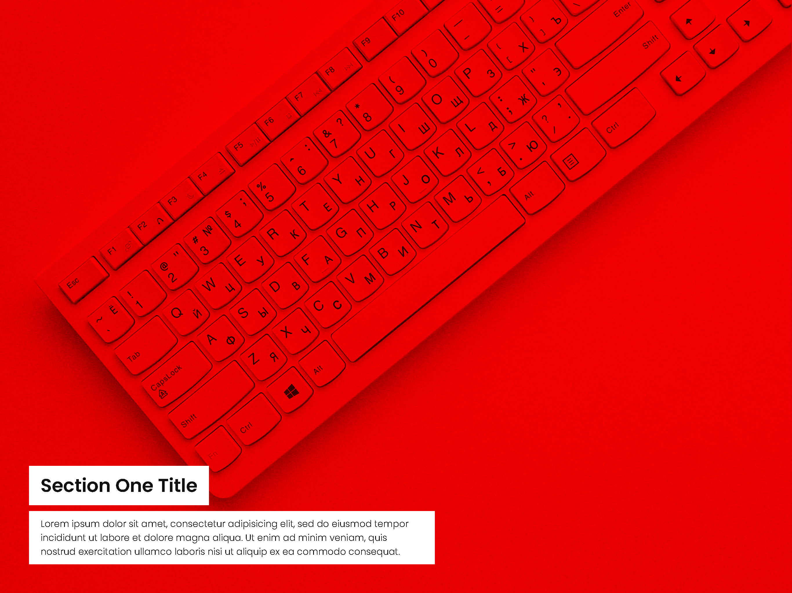

<h1 align = "center">
 
  
   
     
  Scrolling-Parallax: CSS Scroll Effects
   
</ H1>

<h3 align = "center"> User Centric Development </h3>

## Scroll Effect

Full page CSS scroll effects

## Project Specifications

- Image, text, and color change when user scrolls to different sections